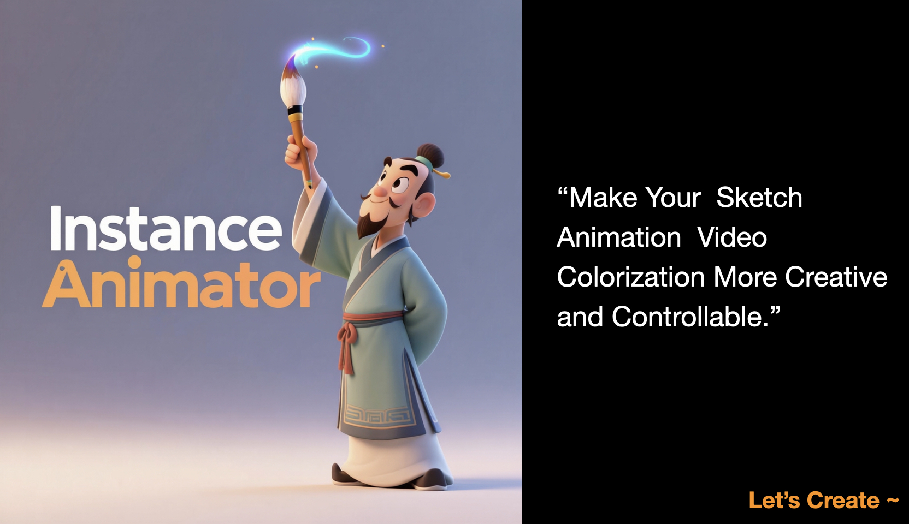

# InstanceAnimator: Multi-Instance Sketch Video Colorization




# News

- 2025-012-16 : release code ✅

## Overview

[](https://www.youtube.com/watch?v=cSNypayMU2w)

</iframe>

We propose InstanceAnimator, a novel Diffusion Transformer framework for multi-instance sketch video colorization.
Existing animation colorization methods rely heavily on a single initial reference frame, resulting in fragmented workflows and limited customizability. To eliminate these constraints, we introduce a Canvas Guidance Condition that allows users to freely place reference elements on a blank canvas, enabling flexible user control. To address the misalignment and quality degradation issues of DiT-based approaches, we design an Instance Matching Mechanism that integrates the instances with the sketch and noise channels, ensuring visual consistency across different sequences while maintaining controllability. Additionally, to mitigate the degradation of fine-grained details, we propose an Adaptive Decoupled Control Module that injects semantic features from characters, backgrounds, and text conditions into the diffusion model, significantly enhancing detail fidelity. 

# Set up

## Environment

    conda create -n InstanceAnimator python=3.12

    pip install -r requirements.txt

## Repository

    git clone https://github.com/YinHan-Zhang/InstanceAnimator.git
    
    cd InstanceAnimator


## OpenAnimate Dataset

We fully open-source our training dataset.

```sh
    modelscope login
    modelscope download --dataset NiceYinHan/OpenAnimate --local_dir ./OpenAnimate
```

# Train

Dataset Format:

```json
{
   "file_path": "video.mp4",
    "sketch_file_path": "sketch.mp4",
    "control_file_path": [
        "instance_1.jpg",
        ...
    ],
    "background_path": "background.jpg",
    "text": "",
    "type": "video"
}
```
After finish data preparation, you can launch training ...
```bash
    bash training/train_control_lora.sh
```

# inference

modify model path in `predict_video_decouple.py`, 

```bash
    python  inference/predict_video_decouple.py
```


# Limitation

Due to the limitations of computing resources and data, the amount of data for model training is limited. If you have enough computing resources, you can train the model yourself.

# Acknowledgement

Thanks for the reference contributions of these works: 
    - VideoX-Fun
