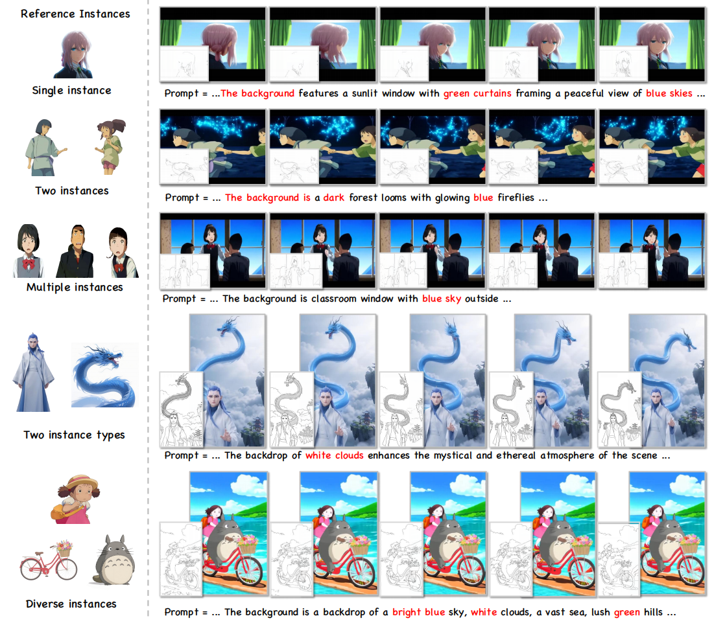
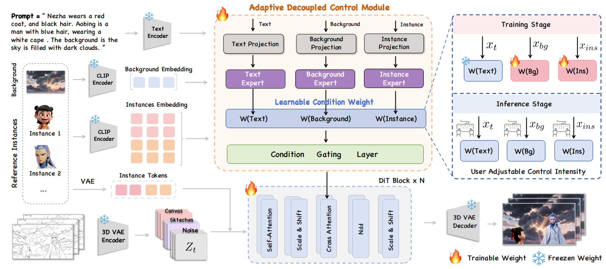
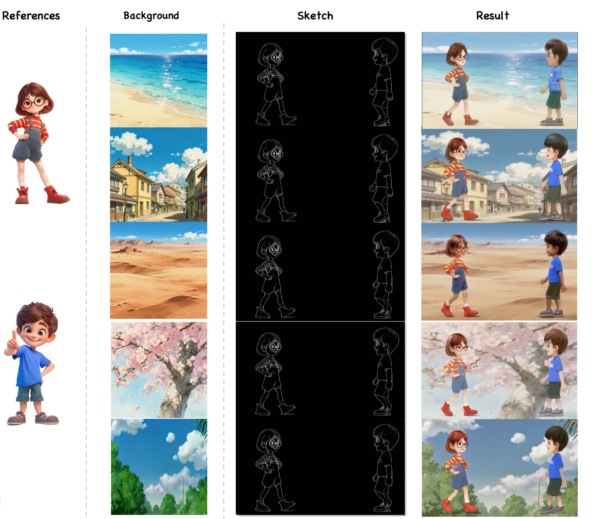

# InstanceAnimator: Multi-Instance Sketch Video Colorization


<p align="center">
    &nbsp&nbsp 🖥️ <a href="https://github.com/YinHan-Zhang/InstanceAnimator">GitHub</a> &nbsp&nbsp | &nbsp&nbsp🤖 <a href="https://modelscope.cn/models/NiceYinHan/InstanceAnimator">ModelScope</a>&nbsp&nbsp | &nbsp&nbsp 📑 <a href="https://arxiv.org"> Paper</a> &nbsp&nbsp <br> 📑 <a href="https://modelscope.cn/datasets/NiceYinHan/OpenAnimate"> Dataset</a> &nbsp&nbsp | 🫰 <a href="https://yinhan-zhang.github.io/animator"> Website</a> 
<br>


# News

- 2025-012-16 : release code ✅

## Overview



We propose InstanceAnimator, a novel Diffusion Transformer framework for multi-instance sketch video colorization.
Existing animation colorization methods rely heavily on a single initial reference frame, resulting in fragmented workflows and limited customizability. To eliminate these constraints, we introduce a Canvas Guidance Condition that allows users to freely place reference elements on a blank canvas, enabling flexible user control. To address the misalignment and quality degradation issues of DiT-based approaches, we design an Instance Matching Mechanism that integrates the instances with the sketch and noise channels, ensuring visual consistency across different sequences while maintaining controllability. Additionally, to mitigate the degradation of fine-grained details, we propose an Adaptive Decoupled Control Module that injects semantic features from characters, backgrounds, and text conditions into the diffusion model, significantly enhancing detail fidelity. 


## Framework


# Application


**We support a dynamic background rendering generation during colorization by visual background guidance. (interal experiment version).**

<div align="center">
  <video src="https://github.com/user-attachments/assets/4517d1ee-86d9-44b3-aaeb-4a00d8a9500f" width="70%" poster=""> </video>
</div>


# Set up

## Environment

```python
conda create -n InstanceAnimator python=3.12

pip install -r requirements.txt
```

## Repository
```python
git clone https://github.com/YinHan-Zhang/InstanceAnimator.git
    
cd InstanceAnimator
```

## Model Weight

```sh
modelscope download PAI/Wan2.1-Fun-14B-Control --local_dir ./Wan2.1-Fun-14B-Control

modelscope download NiceYinHan/InstanceAnimator --local_dir ./ckpt
```

## OpenAnimate Dataset

We fully open-source our training dataset. (Due to the legal copyright issues of the animation dataset, the download of the dataset is restricted. We apologize for any inconvenience.)

```sh
modelscope login

modelscope download --dataset NiceYinHan/OpenAnimate --local_dir ./OpenAnimate
```

# Train

Dataset Format:

```json
{
   "file_path": "video.mp4",
    "sketch_file_path": "sketch.mp4",
    "control_file_path": [
        "instance_1.jpg",
        ...
    ],
    "background_path": "background.jpg",
    "text": "",
    "type": "video"
}
```

After finishing data preparation, you can launch training ...

```bash
bash training/train_control_lora.sh
```

# inference

Modify model path in `predict_video_decouple.py`, 

```bash
python  inference/predict_video_decouple.py
```


# Limitation

Due to the limitations of computing resources and data, the amount of data for model training is limited. If you have enough computing resources, you can train the model yourself.

# Acknowledgement

Thanks for the reference contributions of these works: 
    - VideoX-Fun
